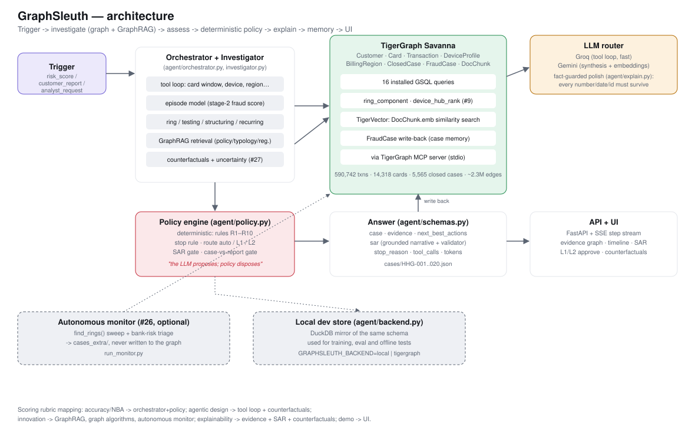

# GraphSleuth

**An agentic fraud investigator that thinks in graphs.**
Built on [TigerGraph](https://www.tigergraph.com) for **Hacker House Goa 2026, Task 04**.

[](https://www.python.org/)
[](tests/)
[](https://savanna.tgcloud.io)
[](LICENSE)
[](https://graphsleuth-production.up.railway.app)

> A transaction scores **0.05** — as safe as a risk model gets. GraphSleuth found a **28-card fraud ring** hiding
> behind it anyway, invisible to the score and visible only by walking the graph: one rare device, shared by cards
> that had never touched before. That single case is the reason this project exists — a risk score is a reason to
> look, never a verdict.

GraphSleuth investigates a fraud alert (risk score, customer report, or analyst request), gathers evidence from a
TigerGraph knowledge graph and GraphRAG over policy, typologies and past cases, assesses risk under uncertainty,
opens and progresses a case, recommends next-best actions within policy and approval limits, executes the ones it's
authorized to act on, and writes what it learned back to the graph as case memory.

📺 **[Live read-only demo](https://graphsleuth-production.up.railway.app)** · 🎬 [Teaser video](brag-output-2026-09-23-005129/brag.mp4) · 📊 [Held-out results](docs/eval_results.md) · 📝 [Blog outline](docs/BLOG_OUTLINE.md)



## Contents
- [Status](#status)
- [Design principle](#design-principle)
- [What it does](#what-it-does)
- [Layout](#layout)
- [Run the analyst UI](#run-the-analyst-ui)
- [Read-only demo (Railway)](#read-only-demo-railway)
- [TigerGraph backend](#tigergraph-backend)
- [Graph algorithms](#graph-algorithms-agenttg_backendpy)
- [Counterfactuals and uncertainty](#counterfactuals-and-uncertainty-agentcounterfactualpy)
- [Mock action execution](#mock-action-execution-agentmock_actionspy)
- [Autonomous monitor](#autonomous-monitor-run_monitorpy-optional)
- [LLM layer](#llm-layer)
- [Quick start](#quick-start)
- [Known limitations](#known-limitations)
- [Submission checklist](#submission-checklist)
- [Credits](#credits)

## Status
Runs end to end on **TigerGraph Savanna**. The graph (590,742 transactions, 14,318 cards, 5,565 closed cases, ~2.3M
edges, counts verified against the source) is loaded, **17 GSQL queries** are installed, and all **20 benchmark
cases** run through them and are written back to the graph as `FraudCase` vertices. The TigerGraph answers are
identical to the local backend's (0 differences over 100 field groups). GraphRAG is live (policy/typology/regulatory
chunks retrieved via TigerVector over the TigerGraph MCP server, grounding evidence, the case summary and the SAR
narrative), agent calls route through the MCP server end to end (verified against 69 live tools), and the LLM layer
runs on real Groq + Gemini keys. Graph algorithms (connected-component ring discovery, HITS hub ranking, card-to-card
link paths) and counterfactual explanations with an uncertainty read-out are wired into the investigator and the UI.
**84 tests pass** (`pytest tests -q`, excluding the live-TigerGraph suite which needs `TG_HOST`). Held-out results:
[docs/eval_results.md](docs/eval_results.md).

## Design principle
**The LLM proposes; a deterministic policy engine disposes.** Fraud probability comes from graph features and a
calibrated scorer; action names, approval routes (`auto` / `L1` / `L2`), the case-vs-report gate, rule R1–R10 and the
stop rule are enforced in code (`agent/policy.py`), so policy is never hallucinated. Only `auto`-route actions ever
execute themselves — `L1`/`L2` actions wait for a human.

## What it does
Mapped directly to the task brief's ten capability points:

| Capability | Where |
|---|---|
| Trigger from risk score, customer report, or analyst request | `case_pack.csv` → `agent/orchestrator.py` |
| Gather evidence from the graph, transaction history, device/identity signals, prior cases, and external policy docs | `agent/investigator.py` (tool loop), `agent/graphrag.py` |
| Identify patterns, classify fraud type, assess risk level | `agent/features.py`, `agent/oof.py`, `agent/investigator.py::_classify_pattern` |
| Create and progress a case; record decisions and actions | `agent/schemas.py::Case`, written to TigerGraph as a `FraudCase` vertex |
| Case memory: retrieve similar cases, use prior outcomes | `agent/memory.py`, `similar_cases()`, cited in `similar_prior_cases` |
| Controlled evidence-gathering (ask customer, step-up auth, ask analyst) | `evidence_requests` in the answer schema, simulated per the task's rules |
| Next-best-action, initial vs. final, with approval routing | `agent/policy.py`, `next_best_actions.{initial,final}` |
| Operate within policy/permissions; only `auto` self-executes | `agent/policy.py` (routes) + `agent/mock_actions.py` (execution) |
| Know when to stop | `agent/policy.py::stop_reached`, `stop_reason` in every answer |
| Explain reasoning, cite the rule | `agent/explain.py`, `evidence[].ref`, reasons cite `R1`–`R10` |

## Layout
| Path | Purpose |
|---|---|
| `data/` | Local DuckDB feature store and the TigerGraph REST loaders |
| `graph/` | GSQL schema and installed queries |
| `agent/` | Orchestrator, tools, scorer, policy engine, memory, mock actions, SAR writer, answer schema |
| `eval/` | Dev-set replay on closed cases and answer validation |
| `api/`, `ui/` | FastAPI + SSE backend and a single-file vanilla-JS investigator UI |
| `static_demo/` | Frozen, credential-free snapshot of the 20 cases — what's actually deployed on Railway |
| `cases/` | The 20 benchmark answer files (graded submission) |
| `cases_extra/` | Cases found by the autonomous monitor, beyond the 20 — Innovation, not accuracy |
| `docs/` | Data findings, [architecture diagram](docs/architecture.svg), demo script, blog outline, eval results |
| `brag-output-*/` | The short launch-teaser video, its Hyperframes source, and share copy |

## Run the analyst UI
```bash
.venv/bin/python run_cases.py                 # writes cases/HHG-001..020.json (validated: python -m eval.validate_answers cases)
.venv/bin/python -m uvicorn api.main:app --port 8000   # then open http://localhost:8000
```
Pick a case and press **Investigate** to watch each tool call stream in, then read the evidence, the initial vs final
actions with their approval routes (L1/L2 actions wait for a human: Approve / Reject — approving or an `auto` route
fires the action via the mock action layer below), the evidence graph, the transaction timeline and the suspicious
activity report.

## Read-only demo (Railway)
[graphsleuth-production.up.railway.app](https://graphsleuth-production.up.railway.app) serves `static_demo/` — a
frozen, pre-computed snapshot of all 20 cases plus the autonomous monitor's finds. It is a **separate,
credential-free deployment**: no TigerGraph secret, no LLM API key, no live-run capability, because the UI has no
login and a public host with real credentials would be a real exposure. "Investigate" replays the actual recorded
tool-call log client-side; nothing is sent anywhere. Regenerate the snapshot with `scripts/freeze_static.py` (needs
live TigerGraph + LLM credentials once, locally) — see `static_demo/README.md`.

## TigerGraph backend
The agent talks to the graph through one interface (`agent/backend.py`). `GRAPHSLEUTH_BACKEND=tigergraph` switches it to
`agent/tg_backend.py`, which calls the installed GSQL queries in `graph/queries.gsql`. `connect()` blocks and retries
(up to 150s) until the workspace actually answers a query before handing back the connection: Savanna auto-suspends
when idle (required by the rules) and the first request after that wakes it, which otherwise surfaces as a confusing
Bad-Gateway/HTML-in-JSON error on whatever call happened to go first — hit and fixed live during development. Setup on
a Savanna workspace (auto-suspend and auto-resume ON):
```bash
cp .env.example .env                           # TG_HOST + TG_SECRET (a Database Secret; no password needed)
python -m data.export_tg                       # load-ready CSVs in data/store/tg/
python - <<'PY'                                # local-schema graph, so it never touches other graphs in the workspace
from pyTigerGraph import TigerGraphConnection; import os
from dotenv import load_dotenv; load_dotenv()
c = TigerGraphConnection(host=os.environ["TG_HOST"], graphname="", gsqlSecret=os.environ["TG_SECRET"], tgCloud=True); c.getToken(os.environ["TG_SECRET"])
print(c.gsql(open("graph/schema.gsql").read()))
PY
python -m data.load_tg                         # REST loader, idempotent (~25 min for the full graph)
python graph/install_queries.py                # creates and installs the 17 queries (~5 min)
GRAPHSLEUTH_BACKEND=tigergraph python run_cases.py && pytest tests/test_tg_live.py
```
The TigerGraph MCP server (`tigergraph-mcp`) connects to the workspace over stdio (verified: 69 tools listed);
`agent/mcp_conn.py` is the adapter that routes the agent's GraphRAG retrieval through it end to end, verified live.
`GRAPHSLEUTH_TG_VIA=mcp` routes the *whole* backend through it instead of direct REST — `MCPConnection` implements
the same pyTigerGraph-shaped subset (`runInstalledQuery`, `getVerticesById`, `upsertVertex`, `upsertEdge`,
`getEdges`) that `TigerGraphBackend` and `TigerGraphCaseMemory` call, so nothing else changes. Verified live end to
end (read and write, `tests/test_tg_live.py::test_mcp_backend_reproduces_local_answer`).

### Graph algorithms (`agent/tg_backend.py`)
`ring_component` (connected-component ring discovery: hops only through devices that are rare AND mostly-New AND
mostly-proxied, so an ordinary shared device never floods the traversal), `device_hub_rank` (HITS power iteration over
the card-device bipartite graph, surfacing the device at the centre of a ring, not just the one with the most cards) and
`card_link` (hop distance between two specific cards). The investigator calls `ring_component` whenever its existing
single-device ring heuristic fires, to check whether the ring reaches beyond that one device.

### Counterfactuals and uncertainty (`agent/counterfactual.py`)
For a case that fired the ring/testing/structuring/customer-report/recurring adjustments, `GET
/api/cases/{id}/counterfactuals` replays the same deterministic probability formula with one signal flipped off,
reporting whether that would cross a policy threshold — plus how far the case sits from the nearest one. Shown in the UI
under the fraud-probability gauge after each live investigation.

### Mock action execution (`agent/mock_actions.py`)
The task brief allows blocking a card, filing a report, or messaging a customer to be "simulated, stubbed, or
represented through mock APIs." `auto`-route actions execute immediately after a run against a mock system of
record (card network, CRM, fraud monitor, regulatory filing queue); an `L1`/`L2` action fires the same way the
moment a human approves it in the UI. Each execution produces a deterministic, timestamped receipt (`data/store/
actions_taken.json`), surfaced in the UI as an "Actions executed" card — never in the graded answer files, which
follow the task's exact schema.

### Autonomous monitor (`run_monitor.py`, optional)
Sweeps the whole graph for alerts the 20 sampled benchmark cases never triggered on — every ring-like device
`find_rings()` finds (not just HHG-014's) and the highest bank-risk-score transactions that were never sampled — and
investigates them the same way `run_cases.py` does. Output goes to `cases_extra/` and is never written back to the
graph, kept separate from the 20 graded answers. Counts toward Innovation, not accuracy, per the task brief.

## LLM layer
`agent/llm.py` routes to Groq (`openai/gpt-oss-120b`, fast tool loop) and Gemini (`gemini-3.6-flash`, synthesis;
embeddings) through their OpenAI-compatible endpoints, with retry/backoff, key rotation, provider fallback, an
on-disk cache and token accounting. `agent/explain.py` lets the model reword the case summary and SAR narrative
behind a **fact guard**: every number, amount, date and ID must survive, otherwise the template text is kept, and a
failed rewrite gets one repair round naming the missing values. Measured with the real providers: 16 of 20 summaries
were reworded and accepted; the SAR rewrites were rejected (the models drop card ids), so SARs stay on the checked
template. Known limit: the guard checks facts, not meaning, so a model can still add a mild inference (e.g. turning
"risk scores stay low" into "chosen to keep risk scores low"). `run_cases.py --no-llm` reproduces the template-only
answers. Keys: `GROQ_API_KEY` / `GEMINI_API_KEY` in `.env`, comma-separated to rotate several.

## Quick start
Verified end to end from a fresh clone: `data/store/` (the DuckDB file and every trained model) is git-ignored, so a
fresh clone has none of it — it all has to be rebuilt once, in this order (each step reads the previous one's
output; `--final` trains on every labelled month, the plain/`--dev` form holds out from 2016-10-01 for the honest
offline eval in `docs/eval_results.md`). Budget **~25-35 minutes**, almost all of it the two scorer runs.
```bash
python3.11 -m venv .venv && .venv/bin/pip install -r requirements.txt
cp .env.example .env                    # add Gemini/Groq keys and Savanna details (only needed for the LLM/TigerGraph paths)
DATA_DIR=../dataset/HHGOA_IEEE .venv/bin/python data/load_local.py   # tx/ident/closed_cases/case_pack/cards -> data/store/graphsleuth.duckdb
.venv/bin/python -m agent.features                            # behavioural features -> the `feat` table (~1 min)
.venv/bin/python -m agent.scorer --final                       # calibrated fraud scorer, all months (~4 min)
.venv/bin/python -m agent.scorer --dev                         # same, held out from Oct 2016 (~4 min)
.venv/bin/python -m agent.pattern --final                      # pattern classifier, all months
.venv/bin/python -m agent.pattern                               # same, held out (bare = dev)
.venv/bin/python -m agent.precompute                            # scores every transaction -> scores_final / scores_dev
.venv/bin/python -m agent.oof                                   # out-of-fold first-stage scores -> scores_oof (~4 min)
.venv/bin/python -m agent.episode --final                       # stage-2 episode (context) model, all months
.venv/bin/python -m agent.episode                                # same, held out (bare = dev)
.venv/bin/python -m pytest tests -q                             # 84 pass; test_tg_live.py skips without TG_HOST
```
Once built, `python run_cases.py` (local backend by default; `GRAPHSLEUTH_BACKEND=tigergraph` for the real thing) and
`python -m uvicorn api.main:app --port 8000` both work without repeating the steps above. Known limitation: the
stage-2 episode model's negative-sampling query (`agent/episode.py`, DuckDB `USING SAMPLE` without a fixed seed) is
not bit-for-bit reproducible between retrains, so a from-scratch rebuild's probabilities move a few points from run
to run; a full fresh-clone rebuild still passes `eval.validate_answers` 20/20 and every test that doesn't need a
live TigerGraph connection.

The provided dataset is not included in this repository. Only the provided dataset is used; the public
Kaggle IEEE-CIS files are never used.

## Known limitations
Said plainly, because a defensible system says what it doesn't do:
- **R6 (shared origin) covers device profiles only**, not billing region or recipient email. Region sharing was
  measured and dropped: billing regions in this dataset hold 90–580 active cards in a 7-day window, with 8–16 of
  them always scoring ≥0.5 by the model's ordinary false-positive rate — no threshold separates a real ring from a
  big city. Recipient email (`R_emaildomain`) isn't in the graph schema at all; adding it means a live schema
  change and reload we chose not to risk this close to the deadline. See `docs/BLOG_OUTLINE.md` §7.10.
- The fact guard on LLM rewrites checks numbers/IDs, not meaning — a model can still turn an observation into a
  causal claim.
- Simulated customer/analyst replies follow the agent's own belief (per the task's own rules — no real replies are
  provided), so they can't independently validate the verdict.
- The dev-set holdout has no ground truth for the exam distribution; its numbers are a proxy, not a guarantee.

## Submission checklist
| Deliverable | Status |
|---|---|
| Working agent | ✅ |
| GitHub repository | ✅ (this repo, public) |
| 20 answer files, schema-valid, every ID real, written to the graph | ✅ `cases/` |
| TigerGraph Savanna + GSQL + graph algorithms + MCP + GraphRAG | ✅ |
| Analyst UI | ✅ `ui/index.html`, deployed read-only on Railway |
| Optional: autonomous monitoring beyond the 20 cases | ✅ `cases_extra/` |
| 3–5 minute demo video | ⏳ short teaser done (`brag-output-2026-09-23-005129/brag.mp4`); full walkthrough pending |
| Technical blog post | ⏳ outline and findings drafted, not yet published |
| Social post tagging `@TigerGraphDB` | ⏳ pending |

## Credits
Dataset: IEEE-CIS Fraud Detection (Vesta Corporation, via the IEEE Computational Intelligence Society), repackaged
for Hacker House Goa 2026 by TigerGraph. Built for TigerGraph's Hacker House Goa 2026, Task 04. Licensed under
[MIT](LICENSE) — the dataset itself is not covered and is not redistributed here.
